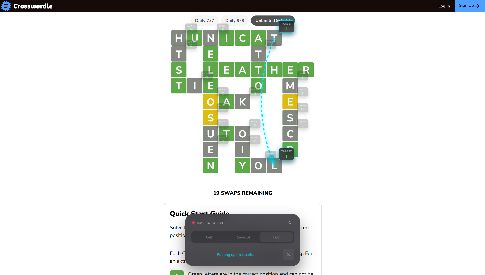

# Crosswordle++

A lightweight, modern browser extension designed to solve Crosswordle(.com) puzzles with optimal efficiency. This project started as a personal side quest into DOM manipulation, reverse-engineering web game states, and some graph algorithms for finding minimal-move solutions.

It finds the answer for a single cell, or a row/column, or the entire board with interactive visual guidance — and can be changed on the fly.

## Overview

Crosswordle++ Solver overlays a tactile interface directly onto the game board, guiding you through the necessary letter swaps. It features:

- **Cell peek**: Just needs a tiny nudge? Check the answer for that one cell!
- **Row/column solver**: Reveal the full line when you're totally stumped.
- **Optimal full board solver**: Generates the exact swap sequence needed to clear the board with maximum efficiency.
- **High-quality overlays**: smooth motion and focused data cards to make execution effortless.

## Installation

### Firefox
Available on the official Add-ons store:
[Download for Firefox](https://addons.mozilla.org/en-US/firefox/addon/crosswordle/)

### Microsoft Edge
*Currently in review.* A link to the Edge Add-ons store will be provided here once the listing is live.

### Google Chrome
Until the extension is listed on the Chrome Web Store, you can install it manually using one of two methods:

#### Option 1: Automated Script (Recommended)
1. Download the `crosswordle-chrome-bundle.zip` from the [latest release](https://github.com/miles2542/crosswordle-solver-extension/releases).
2. Unzip the contents.
3. Right-click `install.ps1` and select **Run with PowerShell**.
4. Follow the interactive prompts to load the extension into Chrome.

#### Option 2: Manual Load
1. Download the `crosswordle-chrome-dist.zip` from the [latest release](https://github.com/miles2542/crosswordle-solver-extension/releases).
2. Unzip to a local folder.
3. Open `chrome://extensions/` in Chrome.
4. Enable **Developer mode** (top-right toggle).
5. Click **Load unpacked** and select the unzipped folder.

## How It Works

The solver operates in three distinct phases to bridge the gap between the static DOM and a dynamic solution:

### 1. State Scraping
The extension uses a `MutationObserver` to stay in sync with the board. It scrapes the current letter values and the expected target values (extracted from `data-answer` attributes, not sure why they left the answer right there in the DOM...*but I'm not complaining*:) to build a reactive internal map of the game state.

### 2. Cycle Decomposition
Finding the minimum number of swaps. Classic permutation problem, just with duplicates, and the space isn't that big (9x9 board maximum, with at least $\frac{2}{3}$ of it either empty, or already correct, so more computationally feasible than it looks). For "Full Board" mode, the engine:
- Maps the transition of every incorrect letter to its target position.
- Partitions these transitions into the maximum number of disjoint cycles.
- Resolves each cycle of length $N$ using $N-1$ swaps, ensuring the absolute minimum move count.

### 3. Reactive UI Overlay
Built with Svelte 5, with a SVG routing layer to draw bezier-curved paths between swap pairs. The "Focused Reveal" mode dims peripheral cells and highlights the active pair with tactile animations, making it much easier to follow and see the swap(s) clearly.

## Development

This extension is built with:
- **Svelte 5**: For the reactive UI layer and state management.
- **Vite**: For blazing-fast bundling and HMR.
- **TypeScript**: Ensuring robustness across the solver logic and DOM interactions.

Created by Miles as a small side project to explore directly interacting with existing sites, packaging it into a ready-to-use extension, and see the publication process for the extension. Simple, fun, and still helpful:)
